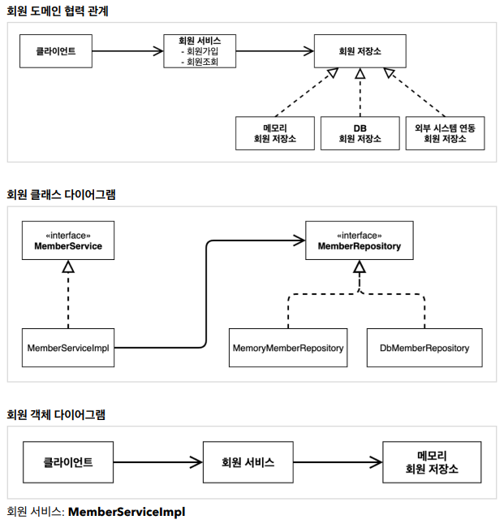
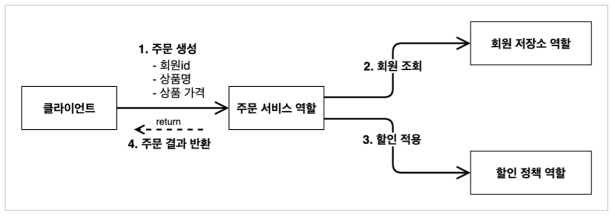
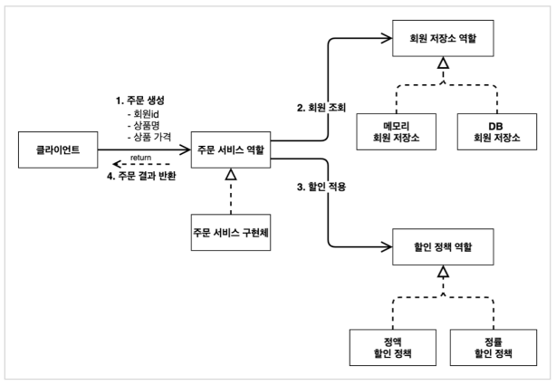
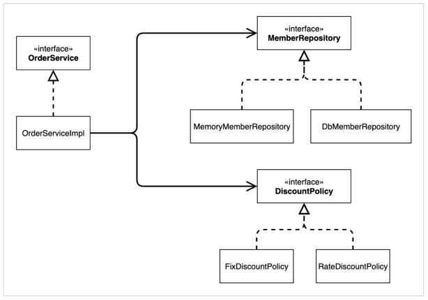

# 스프링 핵심 원리 이해1 - 예제 만들기

## 비즈니스 요구사항과 설계
* 회원
  * 회원을 가입하고 조회할 수 있다
  * 회원은 일반과 VIP 두 가지 등급이 있다
  * 회원 데이터는 자체 DB를 구축할 수 있고, 외부 시스템과 연동할 수 있다 (미확정)
* 주문과 할인 정책
  * 회원은 상품을 주문할 수 있다
  * 회원 등급에 따라 할인 정책을 적용할 수 있다
  * 할인 정책은 모든 VIP는 1000원을 할인해주는 고정 금액 할인을 적용해달라. (나중에 변경 될 수 있다.)
  * 할인 정책은 변경 가능성이 높다. 
    회사의 기본 할인 정책을 아직 정하지 못했고, 오픈 직전까지 고민을 미루고 싶다.
    최악의 경우 할인을 적용하지 않을 수도 있다.

요구사항을 보면 회원 데이터, 할인 정책 같은 부분은 지금 결정하기 어려운 부분이다. 그렇다고 이런 정책이
결정될 때 까지 개발을 무기한 기다릴 수 도 없다. 우리는 앞에서 배운 객체 지향 설계 방법이 있지 않은가!

인터페이스를 만들고 구현체를 언제든지 갈아끼울 수 있도록 설계하면 된다. 그럼 시작해보자.

> 참고:
> 프로젝트 환경설정을 편리하게 하려고 스프링 부트를 사용한 것이다. 
> 지금은 스프링 없는 순수한 자바로만 개발을 진행한다는 점을 꼭 기억하자! 
> 스프링 관련은 한참 뒤에 등장한다. 

## 회원 도메인 설계
* 회원 도메인 요구사항
  * 회원을 가입하고 조회할 수 있다.
  * 회원은 일반과 VIP 두 가지 등급이 있다.
  * 회원 데이터는 자체 DB를 구축할 수 있고, 외부 시스템과 연동할 수 있다 (미확정)



## 회원 도메인 개발
### 회원 Entity
#### 회원 등급
`src/main/member/Grade.java`
```java
public enum Grade {
    BASIC,
    VIP
}
```

#### 회원 Entity
`src/main/member/Member.java`
```java
public class Member {
    private Long id;
    private String name;
    private Grade grade;

    public Member(Long id, String name, Grade grade) {
        this.id = id;
        this.name = name;
        this.grade = grade;
    }

    public Long getId() {
        return id;
    }

    public void setId(Long id) {
        this.id = id;
    }

    public String getName() {
        return name;
    }

    public void setName(String name) {
        this.name = name;
    }

    public Grade getGrade() {
        return grade;
    }

    public void setGrade(Grade grade) {
        this.grade = grade;
    }
}
```

### 회원 저장소
#### 인터페이스
`src/main/member/MemberRepository.java`
```java
public interface MemberRepository {
    void save(Member member);
    Member findById(Long memberId);
}
```

#### 구현체
`src/main/member/MemoryMemberRepository.java`
```java
public class MemoryMemberRepository implements MemberRepository {
    private static Map<Long, Member> store = new HashMap<>();

    @Override
    public void save(Member member) {
        store.put(member.getId(), member);
    }

    @Override
    public Member findById(Long memberId) {
        return store.get(memberId);
    }
}
```

### 회원 서비스
#### 인터페이스
`src/main/member/MemberService.java`
```java
public interface MemberService {
    void join(Member member);
    Member findMember(Long memberId);
}
```

#### 구현체
`src/main/member/MemberServiceImpl.java`
```java
public class MemberServiceImpl implements MemberService {
    private final MemberRepository memberRepository = new MemoryMemberRepository();

    @Override
    public void join(Member member) {
        memberRepository.save(member);
    }

    @Override
    public Member findMember(Long memberId) {
        return memberRepository.findById(memberId);
    }
}
```

## 회원 도메인 실행과 테스트
### 회원 도메인
#### 회원가입 main
`src/main/MemberApp.java`
```java
public class MemberApp {
    public static void main(String[] args) {
        MemberService memberService = new MemberServiceImpl();
        Member member = new Member(1L, "memberA", Grade.VIP);
        memberService.join(member);

        Member findMember = memberService.findMember(1L);
        System.out.println("new Member = " + member.getName());
        System.out.println("find Member = " + findMember.getName());
    }
}
```

> 애플리케이션 로직으로 이렇게 테스트 하는 것은 좋은 방법이 아니다. JUnit 테스트를 사용하자.

#### 회원 가입 테스트
`src/test/member/MemberServiceTest.java`
```java
public class MemberServiceTest {
    MemberService memberService = new MemberServiceImpl();

    @Test
    void join() {
        // given
        Member member = new Member(1L, "memberA", Grade.VIP);

        // when
        memberService.join(member);
        Member findMember = memberService.findMember(1L);

        // then
        Assertions.assertThat(member).isEqualTo(findMember);
    }
}
```

#### 회원 도메인 설계의 문제점
* 이 코드의 설계상 문제점은 무엇일까요?
* 다른 저장소로 변경할 때 OCP 원칙을 잘 준수할까요?
* DIP를 잘 지키고 있을까요?
* **의존관계가 인터페이스 뿐만 아니라 구현까지 모두 의존하는 문제점이 있음**
  * 주문까지 만들고나서 문제점과 해결 방안을 설명

## 주문과 할인 도메인 설계
* 주문과 할인 정책
  * 회원은 상품을 주문할 수 있다.
  * 회원 등급에 따라 할인 정책을 적용할 수 있다.
  * 할인 정책은 모든 VIP는 1000원을 할인해주는 고정 금액 할인을 적용해달라.
  * 할인 정책은 변경 가능성이 높다. 회사의 기본 할인 정책을 아직 정하지 못했고, 오픈 직전까지 고민을 미루고 싶다. 
    최악의 경우 할인을 적용하지 않을 수도 있다.

### 주문 도메인 협력, 역할, 책임


1. 주문 생성: 클라이언트는 주문 서비스에 주문 생성을 요청한다.
2. 회원 조회: 할인을 위해서는 회원 등급이 필요하다. 그래서 주문 서비스는 회원 저장소에서 회원을 조회한다.
3. 할인 적용: 주문 서비스는 회원 등급에 따른 할인 여부를 할인 정책에 위임한다.
4. 주문 결과 반환: 주문 서비스는 할인 결과를 포함한 주문 결과를 반환한다.

> 참고:
> 실제로는 주문 데이터를 DB에 저장하겠지만, 예제가 너무 복잡해 질 수 있어서 생략하고, 
> 단순히 주문 결과를 반환한다.

### 주문 도메인 전체


**역할과 구현을 분리**해서 자유롭게 구현 객체를 조립할 수 있게 설계했다.
덕분에 회원 저장소는 물론이고, 할인 정책도 유연하게 변경할 수 있다.

### 주문 도메인 클래스 다이어그램


## 주문과 할인 도메인 개발
### 할인 정책 인터페이스
`src/main/discount/DiscountPolicy.java`
```java
public interface DiscountPolicy {
    /**
     * 할인 정책
     * @return 할인 대상 금액
     */
    int discount(Member member, int price);
}
```

### 정액 할인 정책 구현체
`src/main/discount/FixDiscountPolicy.java`
```java
public class FixDiscountPolicy implements DiscountPolicy {
    private int discountFixAmount = 1000;

    @Override
    public int discount(Member member, int price) {
        if(member.getGrade() == Grade.VIP) {
            return discountFixAmount;
        } else {
            return 0;
        }
    }
}
```

### 주문 엔티티
`src/main/order/Order.java`
```java
public class Order {
    private Long memberId;
    private String itemName;
    private int itemPrice;
    private int discountPrice;

    public Order(Long memberId, String itemName, int itemPrice, int discountPrice) {
        this.memberId = memberId;
        this.itemName = itemName;
        this.itemPrice = itemPrice;
        this.discountPrice = discountPrice;
    }

    public int calculatePrice() {
        return itemPrice - discountPrice;
    }
    
    /* Getter and Setter */

    @Override
    public String toString() {
        return "Order{" +
                "memberId=" + memberId +
                ", itemName='" + itemName + '\'' +
                ", itemPrice=" + itemPrice +
                ", discountPrice=" + discountPrice +
                '}';
    }
}
```

### 주문 서비스 인터페이스
`src/main/order/OrderService.java`
```java
public interface OrderService {
    /**
     * 주문 생성
     */
    Order createOrder(Long memberId, String itemName, int itemPrice);
}
```

### 주문 서비스 구현체
`src/main/order/OrderServiceImpl.java`
```java
public class OrderServiceImpl implements OrderService {
    private final MemberRepository memberRepository = new MemoryMemberRepository();
    private final DiscountPolicy discountPolicy = new FixDiscountPolicy();

    @Override
    public Order createOrder(Long memberId, String itemName, int itemPrice) {
        Member member = memberRepository.findById(memberId);
        int discountPrice = discountPolicy.discount(member, itemPrice);
        
        return new Order(memberId, itemName, itemPrice, discountPrice);
    }
}
```

## 주문과 할인 도메인 실행과 테스트
### 주문과 할인 정책 실행
`src/main/OrderApp.java`
```java
public class OrderApp {
    public static void main(String[] args) {
        MemberService memberService = new MemberServiceImpl();
        OrderService orderService = new OrderServiceImpl();

        Long memberId = 1L;
        Member member = new Member(memberId, "memberA", Grade.VIP);
        memberService.join(member);

        Order order = orderService.createOrder(memberId, "itemA", 10000);

        System.out.println("order = " + order);
    }
}
```
할인 금액이 잘 출력되는 것을 확인할 수 있다.

애플리케이션 로직으로 이렇게 테스트 하는 것은 좋은 방법이 아니다. JUnit 테스트를 사용하자.

### 주문과 할인 정책 테스트
`src/test/order/OrderServiceTest.java`
```java
public class OrderServiceTest {
    MemberService memberService = new MemberServiceImpl();
    OrderService orderService = new OrderServiceImpl();

    @Test
    void createOrder() {
        long memberId = 1L;
        Member member = new Member(memberId, "memberA", Grade.VIP);
        memberService.join(member);

        Order order = orderService.createOrder(memberId, "itemA", 10000);

        Assertions.assertThat(order.getDiscountPrice()).isEqualTo(1000);
    }
}
```